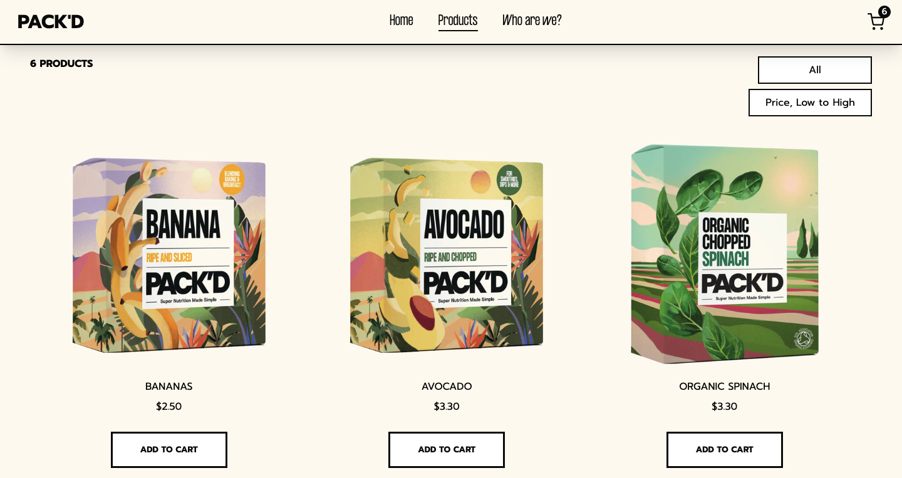

# Pack'd Shop

This is a clone of an e-commerce website called Pack'd, coded with React(Redux + Router) and tailwind.

You can browse through a bunch of products, add/remove them to/from the cart and signup for the newsletter.

## Screenshots



## Get started

Install all modules and their dependencies listed on package.json file:

```bash
npm install
```

Run the app on localhost:

```bash
npm start
```

Build the app for production:

```bash
npm run build
```

## Built with

- React (Redux)
- Tailwind
- Firestore
- Framer motion
